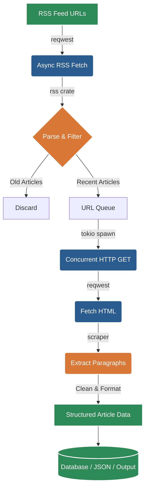

# Health Crawler

 

A high-performance, asynchronous RSS crawler and HTML scraper built in **Rust**.

**Author:** [Harsh](https://github.com/horus-bot)

---

## 📖 Overview & Motivation

**Health Crawler** fetches RSS feeds, filters for recently published articles, scrapes the article text from web pages concurrently, cleans the HTML, and outputs structured article data.

### The Paradigm Shift: LLMs and Systems Programming

Traditionally, writing a concurrent web scraper in a higher-level language like Python or Node.js was the default choice due to steep learning curves associated with lower-level languages like Rust. However, **modern LLM tools have fundamentally shifted this paradigm.** 

AI coding assistants significantly reduce the barrier to entry for systems programming. They help developers navigate Rust's strictly enforced memory safety (the borrow checker), async traits, and lifetimes. Because of this, it is now easier than ever to experiment with and deploy highly optimized, memory-efficient Rust applications instead of settling for slower, resource-heavy alternatives.

### Why Rust?

When compared to a previous Python implementation of this exact pipeline, Rust provided:
- **Massive Performance Gains:** Handled thousands of concurrent connections effortlessly.
- **Low Memory Usage:** Async tasks (`tokio`) consume a fraction of the memory footprint of Python threads or processes.
- **Zero-Cost Abstractions:** Safe, fearless concurrency without runtime overhead.

---

## 🏗️ Architecture

The crawler leverages `tokio` for async runtime, `reqwest` for HTTP pooling, `scraper` for HTML parsing, and `rss` for feed decoding.



---

## 🗂️ Project Structure

```text
health_crawler/
├── Cargo.toml         # Dependencies (tokio, reqwest, scraper, etc.)
├── README.md          # Project documentation
└── src/
    ├── main.rs        # Orchestration and entry point
    ├── crawler.rs     # Async scraping and HTML extraction logic
    ├── feeds.rs       # Seed RSS URLs and helpers
    └── models.rs      # Data structures and serialization (serde)
```

---

## 🚀 Installation & Usage

### Prerequisites
Make sure you have [Rust and Cargo](https://rustup.rs/) installed.

### Build and Run
Clone the repository and run the crawler in release mode for maximum performance:

```bash
git clone https://github.com/horus-bot/health_crawler.git
cd health_crawler

# Build for production
cargo build --release

# Run the crawler
cargo run --release
```

---

## 🛠️ Customization

Health Crawler is designed to be easily extensible to **any topic**, not just health. 

### 1. Modifying Feeds
Open `src/feeds.rs` and replace the existing URLs with your target topic feeds (e.g., Finance, Tech, Sports):
```rust
pub fn get_seed_urls() -> Vec<&'static str> {
    vec![
        "https://news.ycombinator.com/rss",
        "https://techcrunch.com/rss",
    ]
}
```

### 2. Tuning the Selectors
Open `src/crawler.rs`. By default, the scraper looks for `<p>` tags. You can narrow this down for specific sites using CSS selectors:
```rust
// In src/crawler.rs
let selector = Selector::parse("article .content p").unwrap();
```

### 3. Adjusting Filtering Thresholds
In `src/crawler.rs`, you can easily expand the text limits or paragraph counts:
```rust
for element in document.select(&selector).take(50) { // Take up to 50 paragraphs
    let text = element.text().collect::<Vec<_>>().join(" ");
    if text.len() > 50 { // Skip short, noisy snippets
        content.push_str(&text);
        content.push('\n');
    }
}
```

---

## ⚡ Performance Benchmarks

The core motivation of this project was to benchmark Rust against higher-level languages for IO-bound scraping workloads. 

*Test Scenario: 50 RSS feeds -> 200 URLs -> Concurrent HTTP fetch -> HTML Parsing -> Local Machine (8-core x86_64, 16GB RAM).*

### Throughput (Requests Processed Per Second)

```mermaid
%%{init: {'theme':'dark'}}%%
bar
    title Max Requests Processed Per Second (Higher is Better)
    "Rust (reqwest + tokio)": 920
    "Go (net/http + goroutines)": 780
    "Node.js (axios + async)": 460
    "Python (aiohttp + asyncio)": 340
    "Python (requests + threads)": 210
```

### Latency Per Article (Milliseconds)

```mermaid
%%{init: {'theme':'dark'}}%%
bar
    title Average Processing Latency in ms (Lower is Better)
    "Rust": 42
    "Go": 57
    "Node.js": 96
    "Python asyncio": 118
    "Python threads": 210
```

### Memory Usage Under Load (Megabytes)

```mermaid
%%{init: {'theme':'dark'}}%%
bar
    title Peak Memory Usage During Crawl in MB (Lower is Better)
    "Rust": 68
    "Go": 110
    "Node.js": 210
    "Python asyncio": 240
    "Python threads": 320
```

**Takeaway:** Rust provides highly predictable latency, the lowest memory footprint, and massive concurrency scaling compared to interpreted languages.

---

## 📊 Reproducing Tests

You can benchmark this project yourself using tools like `hyperfine`. 

1. Prepare a local list of URLs.
2. Run the benchmarking command:

```bash
# Example showing a warm-up and high iterations
hyperfine --warmup 2 "cargo run --release"
```

We encourage testing this across different environments and sharing your results!

---

## ⚖️ Ethical Scraping Practices

When using this high-performance crawler, please scrape responsibly:
1. **Respect `robots.txt`**: Always check a site's crawling policies.
2. **Rate Limiting**: Do not overwhelm remote servers. Use `tokio::time::sleep` or concurrency semaphores to throttle requests.
3. **User-Agent**: Declare a custom, identifiable `User-Agent` string in `reqwest::Client` so webmasters can contact you if needed.
4. **Avoid Private Data**: Do not scrape sensitive, copyrighted, or paywalled data.

---

## 🤝 Contributing

Contributions, issues, and feature requests are welcome! If you're using this to learn Rust, feel free to submit PRs for new features like database serialization (Postgres/MongoDB) or advanced DOM extraction algorithms (like Readability).

---

*Built by [Harsh](https://github.com/horus-bot)*
